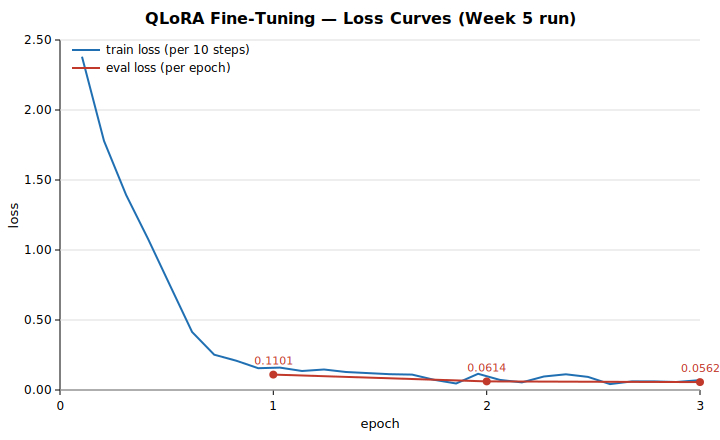

# Week 6 — Fine-Tuning Training Report (D4)

- **Model:** Qwen/Qwen2.5-3B-Instruct + QLoRA LoRA adapter
- **Training completed:** 2026-07-17T16:31:09.100270+00:00
- **Generated:** 2026-07-18T08:48:53.110332+00:00
- **Data:** 1550 train / 192 validation examples (Week 3 dataset, unchanged)
- **Runtime:** 3.8 h (3 epochs, precision bf16)

All training and evaluation performed **fully offline** (HF_HUB_OFFLINE=1, local weights, no external services).

## Training Configuration (document Section 5.4)

| Parameter | Value |
|---|---|
| LoRA rank r | 16 |
| LoRA alpha | 32 |
| LoRA dropout | 0.1 |
| Target modules | q_proj, v_proj, k_proj, o_proj |
| Quantization | 4-bit nf4, double quant, bf16 compute |
| Batch size × grad accum | 2 × 8 (effective 16) |
| Learning rate | 0.0002 (cosine, warmup 0.1) |
| Epochs | 3 |

## Loss Curves

Per-epoch losses (from `models/checkpoints/training_summary.json`):

| Epoch | Eval loss | Train loss (last logged step) |
|---|---|---|
| 1 | 0.1101 | 0.1559 |
| 2 | 0.0614 | 0.1160 |
| 3 | 0.0562 | 0.0693 |
| — | final train loss (mean over run): 0.3541 | |

## Overfitting Diagnosis

**Verdict: CONVERGED — NO OVERFITTING, NO UNDERFITTING**

Validation loss decreased monotonically across all epochs and finished low, tracking the training loss without divergence. There is no epoch at which validation loss rises, so no overfitting; the large reduction from the first to the final epoch rules out underfitting.

Evidence: eval loss 0.1101 → 0.0614 → 0.0562 across epochs 1–3 (total reduction 48.9%).

## Hyperparameter Iteration Decision

Document Section 5.4 defines the iteration rule for the LoRA rank: *"start with 16, try 32 if underfitting"*. The run above used r=16.

The diagnosis shows no underfitting (and no overfitting), so the document's condition for a second run (r=32) is **not triggered**. The fine-tuning iteration loop — train → inspect loss curves → decide — terminates after one run with **r=16 retained**. No further training run is mandated by the document.

## Best Model Checkpoint Identification

Lowest validation loss occurs at **epoch 3** (eval loss 0.0562).

- Saved per-epoch checkpoints: `models/checkpoints/checkpoint-97` (epoch 1), `checkpoint-194` (epoch 2), `checkpoint-291` (epoch 3).
- `models/checkpoints/final-adapter/` was saved immediately after training ended (no steps after the epoch-3 save), so its LoRA weights are **identical to checkpoint-291**, the lowest-eval-loss epoch.

**Best checkpoint = `models/checkpoints/final-adapter/`** (inference-ready: adapter + tokenizer + chat template). `checkpoint-291` carries the same weights plus optimizer state for training resumption.

## Baseline vs Fine-Tuned Comparison (D4: improvement over baseline)

| Metric (Section 6.1) | Baseline | Fine-Tuned (Δ) | Target | Status |
|---|---|---|---|---|
| Severity Accuracy | 43.9% | 73.7% (+0.298) | > 85.0% | IMPROVED |
| Incident Type F1 (macro) | 0.001 | 0.215 (+0.215) | > 0.800 | IMPROVED |
| ROUGE-L (summaries) | 0.121 | 0.594 (+0.473) | > 0.550 | IMPROVED |
| False Positive Rate | 33.3% | 8.7% (-0.246) | < 10.0% | IMPROVED |
| Output parse failures | 8.1% | 0.0% (-0.081) | — | IMPROVED |

Root Cause Accuracy remains a human evaluation (see example outputs in the evaluation reports). API p95 latency (Week 9) and RAG P@3 (Week 7) are out of Week 6 scope; confusion matrices and the 3-way baseline/fine-tuned/RAG table belong to D6 (Week 8).

## Artifacts

- `models/checkpoints/final-adapter/` — best checkpoint / LoRA adapter (D4)
- `models/checkpoints/checkpoint-{97,194,291}/` — per-epoch checkpoints with trainer state
- `models/checkpoints/training_summary.json` — raw run log
- `reports/loss_curves.svg` — loss curves (this report)
- `reports/finetuned_metrics.json` / `finetuned_predictions.jsonl` / `Week6_Finetuned_Evaluation_Report.md` — fine-tuned evaluation (D4)

---
*Generated by `python -m src.training.training_report` (Week 6 deliverable: training report).*
